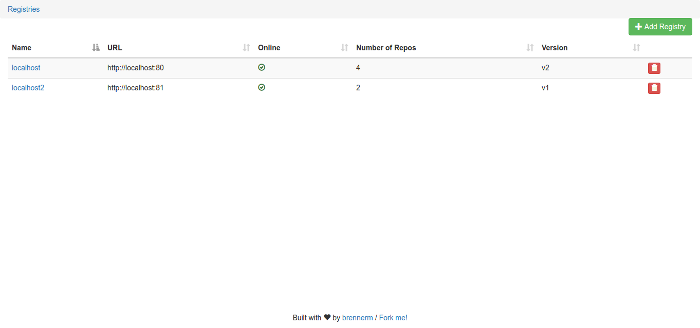
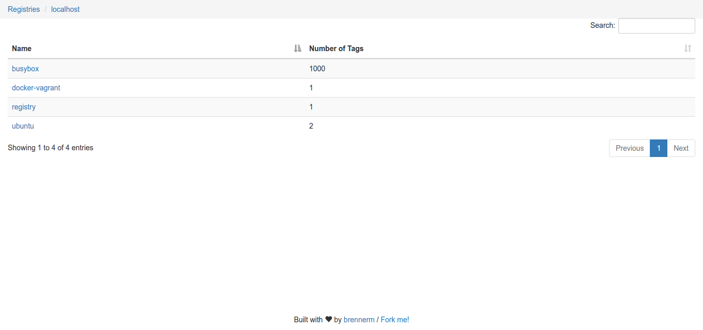
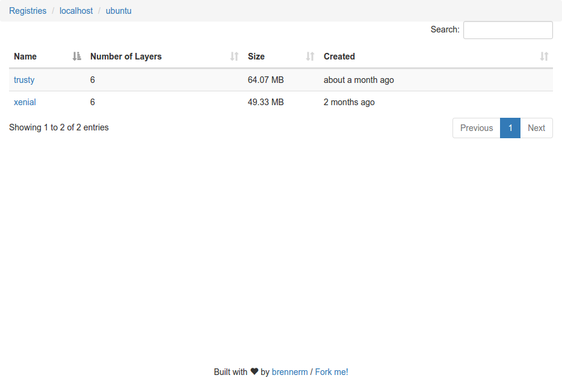
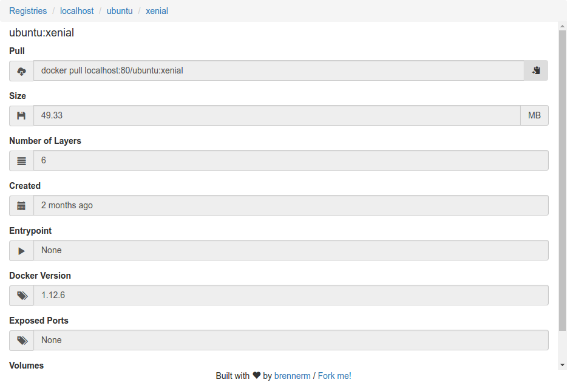

# docker_registry_frontend

Web front end to display the content of multiple Docker registries

This is a fork from `git@github.com:brennerm/docker-registry-frontend.git`

My modifications are:

- removed the nginx component in the Dockerfile
- tweaked the Dockerfile in general
- using alpine 3.10
- replaced bower component with yarn

## Feature Overview

- browse available Docker images and check the availability of multiple Docker registries
- add and remove registries via the web interface
- delete repositories and tags (automatically detected if registry supports it)
- support for Docker registries V1 and V2
- get detailed information about your Docker images
- supports Basic Auth protected registries

## Usage

```hcl
python3 frontend.py -h

usage: frontend.py [-h] [-d] [-i IP_ADDRESS] [-p PORT] config

positional arguments:
  config

optional arguments:
  -h,            --help            show this help message and exit
  -d,            --debug           Run application in debug mode
  -i IP_ADDRESS, --ip-address      IP_ADDRESS IP address to bind application to
  -p PORT,       --port PORT       Port to bind application to

python3 frontend.py config.json
```

Alternatively you can use the prebuilt Docker image.

```hcl
docker run -d \
--name registry_frontend \
--restart unless-stopped \
-p 8073:8080 \
-e PUID="1000" \
-e PGID="1000" \
-e TZ=Europe/London \
-v /local/path/to/persist/data:/opt \
henkez/docker_registry_frontend
```

This makes the frontend available at <http://127.0.0.1:8073>

## Configuration

### Caching

It's possible to enable a caching functionality to keep the frontend fast even when viewing thousands of repos and tags.
By default it's disabled as there is no need for small registries. To enable it set a value for the cache timeout in seconds.

```json
{
  "cache_timeout": 3600
}
```

### Supported storage drivers

The frontend supports various kinds of storages to persists the configuration.
The following options are currently implemented:

- SQLite

```json
{
  "storage": {
    "driver": "sqlite",
    "file_path": "db.sqlite"
  }
}

```hcl
 Set the "file_path" value to ":memory:" to use an in-memory database.

- JSON File

```json
{
  "storage": {
    "driver": "json",
    "file_path": "db.json"
  }
}
```

## Images

### Registry Overview



### Repository Overview



### Tag Overview



### Tag Detail


